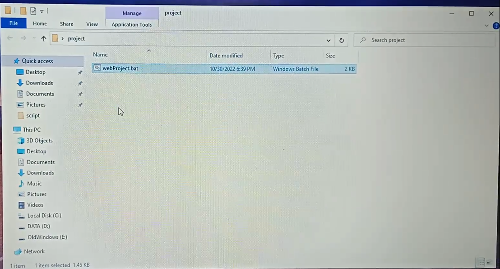

# Web Script 
## Creating the standard tree structure for web project

---
This is a simple tool helps web developers to create the standard web tree structure.

---
## Features

### It creates the following:
- index.html file
- README.md file 
- images folder
- css folder
- js folder
- styles.css in css folder
- main.js in js folder
------ 
- Then it opens ```index.html``` file Google Chrome broswer & the project folder in VScode.
- At the end the script delete itslef, to maintain the web  standard tree structure.
---
## Usage:
1- Download the project using:
```
git clone https://github.com/Ahmed-Osama2022/web-script.git
```
```
Or just download the script from the GitHub repository.
```

2- Copy the script at first to your project folder.

3- Douple click on the script to run it.

4- And just wait the beauty things happens!!

---
## Screenshots:
- Project Folder

- Script running

- Stanadard web tree Structure

- Opining the index.html file in Google Chrome browser

- Opining the project folder in VScode


- Note:
```
Sorry for the poor quality images!!
```
---
## Important Notes:
- This only works in Windows PCs!
- Make sure you copy the script in your project folder at first and make sure it is a copy not moving method!
- The script ```DELETE ITSELF``` after finishing!
- Some anivirus softwares may recognize the script as a ``` Virus```, Don't worry, It's because the file ends with extension ```.bat```

---

### This was made by Ahmed Osama
---
### Link to GitHub account of creator:

``` 
https://github.com/ahmed-osama2022
```

